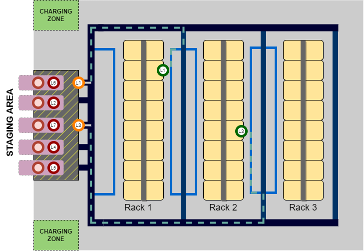
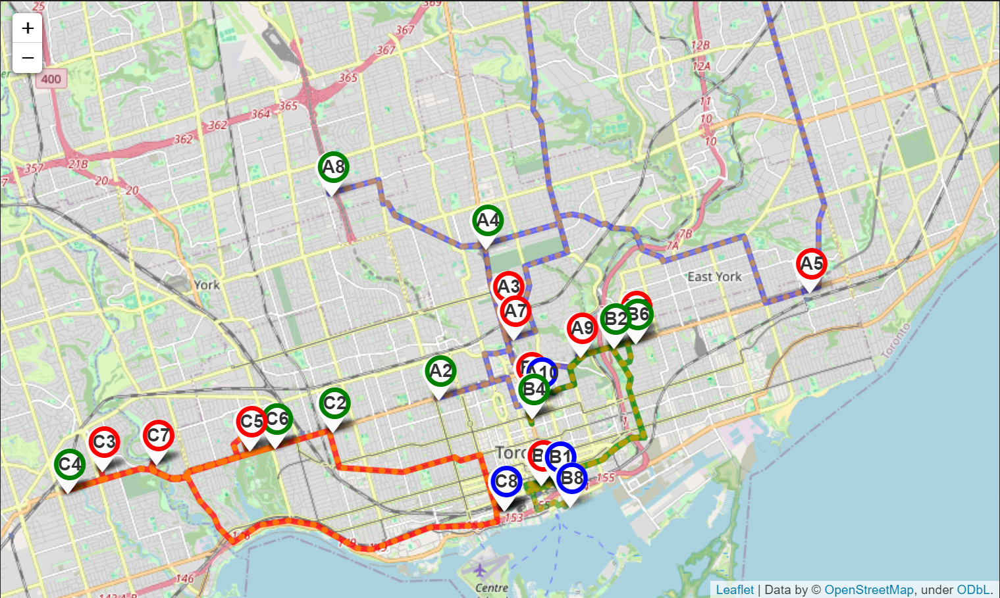
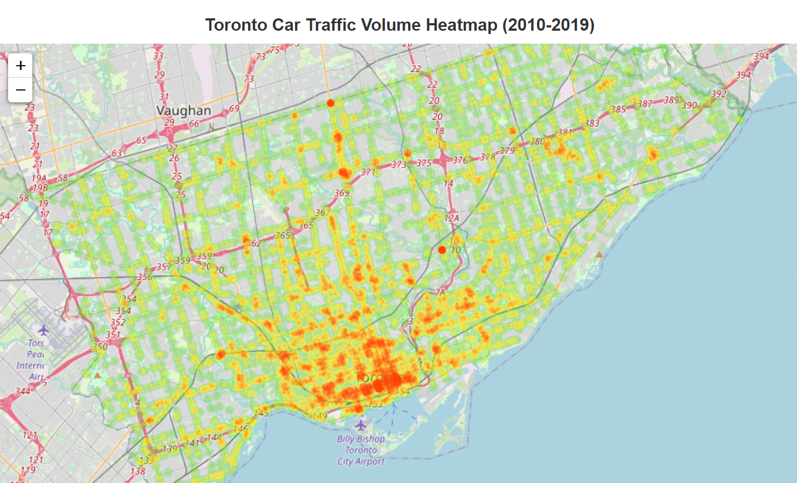

# Smart Mobility Projects

## [Efficient Task Allocation for Multi-Robot Systems](./multi-robot-task-allocation/README.md)

In warehouses, optimally assigning tasks to multiple robots is a critical challenge, as it is an **NP-hard problem.** This project tackles this **Multi-Robot Task Allocation (MRTA)** problem using a modified **Particle Swarm Optimization (PSO)** technique. We optimize task scheduling while considering factors like makespan, charge availability, and load distribution across mobile robots.




## [Car Sharing Service](./car-sharing-service/CarSharing.ipynb)

Shared mobility technology has evolved significantly, leading to the widespread adoption of various shared transportation services. These include car sharing, bike sharing, scooter sharing, ridesharing, ridehailing, ridesourcing, and demand-responsive transit (DRT). In this project, we focus on tackling the car-sharing service problem using various bio-inspired algorithms.



## [Geopspatial Analysis](./geospatial-analysis/Car_Traffic_Volume_Toronto.ipynb)
Understanding urban mobility requires analyzing how traffic flows across a city over time. Using data from [Toronto Open Data](https://open.toronto.ca/dataset/traffic-volumes-at-intersections-for-all-modes/), this project explores traffic volume distributions in Toronto from **2010 to 2019**. Using different **geospatial analysis** techniques, we aim to uncover patterns in Toronto’s traffic flow, identify congestion hotspots, and gain insights into urban mobility trends.



## Dependencies
A complete list of packages required in this project is included in  `requirements.txt`. For detailed setup information, please refer to this excellent repository by Dr Alaa Khamis: [SmartMobilityAlgoithms/GettingStarted](https://github.com/SmartMobilityAlgorithms/GettingStarted).  
## References
```
@misc{Khamis2022,
  title = {ECE1724H: Bio-inspired Algorithms for Smart Mobility. University of Toronto, Course instructor: Dr. Alaa Khamis},
  year = {2022},
  howpublished = {\url{https://smartmobilityalgorithms.github.io/book/index.html}}
}
```